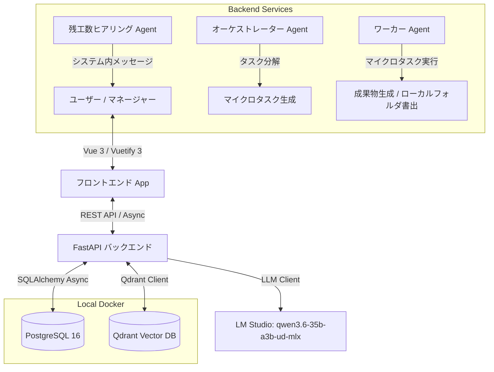

# AI-PMO (自律協働型プロジェクト管理ツール) 更新実装計画書

ユーザー様のフィードバックを反映した、最新の実装方針である。

---

## 1. 全体アーキテクチャ設計

システムは **FastAPI (バックエンド) + Vue.js 3 / Vuetify 3 (フロントエンド)** の2レイヤー構成で開発する。
データベースおよびベクトルDBは、本プロジェクト用に `docker-compose.yml` を新規作成し、ローカル起動する。



---

## 2. フィードバック反映・決定事項

> [!IMPORTANT]
> **1. 新規データベースインフラ (`docker-compose.yml`)**
> プロジェクトルートに `docker-compose.yml` を作成し、PostgreSQL 16 と Qdrant (latest) を定義します。
> ポート競合に備え、デフォルトの `5432` / `6333` を使用しつつ、`.env` からポートを変更可能にします。
> 
> **2. LM Studio 接続 (モデル名: `qwen3.6-35b-a3b-ud-mlx`)**
> - `LLM_BASE_URL`: `http://localhost:1234/v1`
> - `LLM_MODEL_NAME`: `qwen3.6-35b-a3b-ud-mlx`
> フォールバックモックは実装せず、LM Studio への直接接続を前提とします。モデルがロードされていない場合は、エラーハンドリングを行いユーザーにロードを促す通知を出します。
> 
> **3. 外部チャット連携の廃止とシステム内メッセージング**
> 外部（Slack/Teams等）への接続は行わず、システム内部の「メッセージング・通知機能」を構築します。AIからの残工数ヒアリングや通知は、このシステム内メッセージングを通じて行われます。
> RAGの夜間バッチは、システム内のドキュメント、タスク履歴、およびメッセージのやり取りをクロールしてベクトル化します。
> 
> **4. リポジトリ管理の拡張性**
> 開発時点では、ワーカーの生成した成果物（ソースコード、ドキュメント）をバックエンド内のローカルフォルダに書き出します。将来的に Git / GitHub を登録・連携できるよう、データベーススキーマ（`repositories` テーブル）は拡張性を持たせて設計します。
> 
> **5. フロントエンド：ダークモード・グラスモーフィズム**
> Vuetify 3 のカスタムテーマと CSS backdrop-filter を駆使し、半透明のカード、美しいグラデーション、すりガラス効果（Glassmorphism）を取り入れたダークモードデザインを構築します。
> 
> **6. インタラクティブ・ガントチャート**
> 手動でのスケジュール調整（ドラッグ＆ドロップ）を可能にするため、SVGでの自作を避け、オープンソースの **`frappe-gantt`** ライブラリを採用し、Vue 3 コンポーネントとしてラップして組み込みます。これにより、プランB（AI提案）と通常スケジュールの比較・手動調整が容易になります。

---

## 3. ディレクトリ構成案

### 3.1 プロジェクトルート (`/`)
```
ai-pmo/
├── docker-compose.yml      # PostgreSQL 16 & Qdrant の定義
├── backend/                # FastAPI バックエンド
└── frontend/               # Vue 3 フロントエンド
```

### 3.2 バックエンド (`backend/`)
```
backend/
├── app/
│   ├── __init__.py
│   ├── main.py              # アプリケーション初期化、CORS、グローバル例外ハンドラー
│   ├── config.py            # 環境変数管理
│   ├── database.py          # SQLAlchemy 非同期セッション
│   ├── api/
│   │   ├── __init__.py
│   │   ├── router.py        # 統合ルーター
│   │   └── v1/
│   │       ├── endpoints/
│   │       │   ├── tasks.py     # タスク・サブタスク (Plan-First)
│   │       │   ├── standup.py   # デイリーサマリー
│   │       │   ├── plan_b.py    # ヒアリングと Plan B 再計算
│   │       │   ├── knowledge.py # RAGナレッジ、クレンジング
│   │       │   ├── messages.py  # システム内メッセージング (AIチャット/ヒアリング用)
│   │       │   ├── comments.py  # 成果物インラインコメント
│   │       │   └── command.py   # コマンドパレット (Cmd+K)
│   ├── core/
│   │   └── exceptions.py    # カスタム例外とレスポンス統一
│   ├── models/
│   │   ├── __init__.py
│   │   ├── task.py          # WBS タスク
│   │   ├── subtask.py       # マイクロタスク (AI実行)
│   │   ├── plan.py          # Plan-First方針
│   │   ├── comment.py       # インラインコメント
│   │   ├── knowledge.py     # RAGナレッジ
│   │   ├── message.py       # システム内メッセージ
│   │   └── repository.py    # [NEW] リポジトリ情報 (ローカル / 将来のGit)
│   ├── schemas/
│   │   ├── task.py
│   │   ├── subtask.py
│   │   ├── plan.py
│   │   ├── comment.py
│   │   ├── knowledge.py
│   │   ├── message.py
│   │   └── repository.py
│   └── services/
│       ├── llm.py           # LM Studio API クライアント (qwen3.6-35b-a3b-ud-mlx ターゲット)
│       ├── orchestrator.py  # タスク分解
│       ├── worker.py        # マイクロタスク実行 (ローカルフォルダ書き出し)
│       ├── risk_engine.py   # プランB再構築 (残工数反映)
│       └── rag.py           # Qdrant 連携 & 夜間バッチ (内省クロール)
├── requirements.txt
└── run.py
```

### 3.3 フロントエンド (`frontend/`)
```
frontend/
├── index.html
├── vite.config.js
├── package.json
└── src/
    ├── main.js
    ├── App.vue              # Cmd+K コマンドパレットを統合
    ├── index.css            # グローバルグラスモーフィズムデザインシステム
    ├── plugins/
    │   └── vuetify.js       # Vuetify 3 (ダークテーマ設定)
    ├── router/
    │   └── index.js
    ├── store/
    │   └── project.js       # Pinia ストア
    ├── components/
    │   ├── CommandPalette.vue   # コマンドパレット
    │   ├── DailyStandup.vue     # 朝会ポップアップ
    │   ├── GanttChart.vue       # frappe-gantt ラッパー (ゴーストDiff重ね合わせ描画)
    │   ├── InlineComments.vue   # 成果物インラインコメント
    │   ├── KnowledgeCleansing.vue # 低適合度ナレッジのクレンジング
    │   └── HearingChat.vue      # システム内ヒアリングチャット
    └── views/
        ├── Dashboard.vue        # 朝会サマリー + メイン
        ├── GanttView.vue        # WBS / ガントチャート
        ├── KnowledgeView.vue    # ナレッジコントロールパネル
        └── ArtifactsView.vue    # 成果物レビュー画面
```

---

## 4. データベース設計 (主要テーブル追加・変更)

### 4.1 `repositories` (成果物リポジトリ) - [NEW]
将来の GitHub 連携を考慮した設計。
- `id` (UUID, Primary Key)
- `name` (VARCHAR) - リポジトリ名
- `type` (VARCHAR) - `LOCAL`, `GITHUB`
- `path` (VARCHAR) - ローカルフォルダパス、または GitHub Repo URL
- `config` (JSON) - トークン等の設定

### 4.2 `messages` (システム内メッセージ) - [NEW]
遅延時のヒアリングやAIとの対話用。
- `id` (UUID, Primary Key)
- `sender_type` (VARCHAR) - `USER`, `AI_PMO`, `AI_WORKER`
- `content` (TEXT)
- `task_id` (UUID, ForeignKey -> `tasks.id`, NULL) - 特定タスクに紐づくヒアリング
- `created_at` (TIMESTAMP)

---

## 5. UI/UX・画面インターフェース要件

### 5.1 ダークモード・グラスモーフィズムデザイン
- 背景には、深みのある濃紺〜黒のグラデーション (`background: radial-gradient(circle, #0e121a, #05070a)`) を採用。
- カードやダイアログ、ナビゲーションバーは、半透明のガラス効果を適用。
  `background: rgba(255, 255, 255, 0.05); backdrop-filter: blur(16px); border: 1px solid rgba(255, 255, 255, 0.1);`
- ネオンブルー (`#00f2fe`) やネオンパープル (`#4facfe`) などのアクセントカラーを用い、極めて未来的でプレミアムな質感を演出。

### 5.2 `frappe-gantt` による Diff (差分) UI
- 通常スケジュール (通常バー) に重ねて、プランBスケジュール (点線かつ半透明のゴーストバー) を描画。
- `frappe-gantt` のカスタム描画フック、または CSS 重ね合わせによってこれを実現。
- ドラッグによって手動調整された日程はリアルタイムで Pinia ストアに同期され、バックエンドの再計算 API に送信可能。

---

## 6. 検証計画

### 6.1 自動テスト
- Pytest を使用し、タスク分解ロジック、プランB再計算ロジック、Qdrant接続テストを実行。

### 6.2 手動検証
1. `docker compose up -d` で PostgreSQL 16 と Qdrant が正常に起動すること。
2. 朝会サマリー、コマンドパレット (`Cmd + K`)、ガントチャート上のプランBゴースト表示、ナレッジ・クレンジング、成果物のインラインAIコメントのそれぞれの機能がグラスモーフィズム UI で動作すること。
