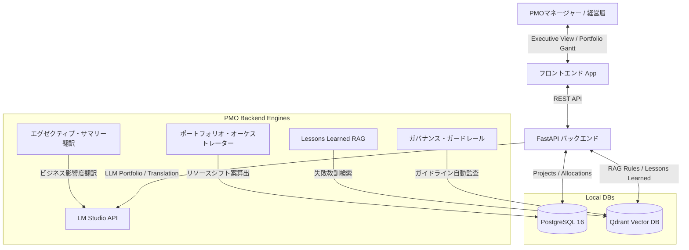

# AI-PMO (自律協働型プラットフォーム) マクロ機能拡張 実装計画書

PMOとしての複数プロジェクト管理（ポートフォリオ）、品質監査ガバナンス、Lessons Learned、および経営層向けレポーティングを追加する計画書である。

---

## 1. 拡張アーキテクチャ設計

組織全体を管理するマクロレイヤーを追加し、複数プロジェクトや共有リソースを横断管理する構造へ拡張する。

---

## 2. ユーザーレビュー・確認事項

> [!IMPORTANT]
> **1. ポートフォリオ・ガントチャートでの複数プロジェクト表示**
> 組織に紐づく複数プロジェクトのタスク群を1画面に並べたガントチャートを構築します。
> ポートフォリオ・オーケストレーターが「リソースの20%をプロジェクトBからAにシフトする」という提案を出した際、対象となる双方のプロジェクトのスケジュール（ゴースト表示）が連動して変化するインタラクションを構築します。
> 
> **2. 経営層向けレポートにおける EVM (Earned Value Management) 指標**
> ITに詳しくない経営層向けに、進捗度から EV (Earned Value), PV (Planned Value), AC (Actual Cost) をシミュレートし、文字ベースの進捗遅れ（%表示など）ではなく「DX成果発現の遅れリスク（日数）」や「コスト影響（金銭換算）」へLLMで変換・翻訳するロジックを実装します。
> 
> **3. Qdrant の新コレクション追加とデータ初期シーディング**
> 監査ルール用の `governance_rules`、および過去の失敗教訓用の `lessons_learned` をQdrant内に自動初期作成し、起動時にいくつかの「典型的なセキュリティ規則」「過去の決済API接続トラブルの教訓」をシード（初期投入）して、検証できるように構成します。
> 
> **4. 画面コンテキスト自動インジェクション (Cmd+K)**
> ユーザーがガントチャート画面を開いている状態で `Cmd+K` を起動し「このスケジュールを最適化して」と打った際、画面内のプロジェクトIDや選択されているタスクIDを自動検出し、バックエンドのコマンド実行 API にコンテキストパラメータとして送信する仕組みを実装します。

---

## 3. データベーススキーマ拡張設計

### 3.1 `projects` (プロジェクト情報) - [NEW]
- `id` (UUID, Primary Key)
- `name` (VARCHAR) - プロジェクト名
- `organization_id` (UUID) - 組織ID (複数プロジェクトの束ね用)
- `status` (VARCHAR) - `ACTIVE`, `COMPLETED`, `SUSPENDED`
- `created_at` (TIMESTAMP)

### 3.2 `resource_allocations` (稼働率 & スキル) - [NEW]
- `id` (UUID, Primary Key)
- `project_id` (UUID, ForeignKey -> `projects.id`)
- `resource_name` (VARCHAR) - 要員名 (人間、または `AI_WORKER`)
- `skill_tags` (JSON) - スキルセット (例: `["Vue3", "FastAPI", "Security"]`)
- `allocation_percent` (INTEGER) - 稼働率 (0 - 100%)
- `is_ai` (BOOLEAN) - AIエージェントかどうか

### 3.3 `tasks` (既存テーブルの拡張)
- `project_id` (UUID, ForeignKey -> `projects.id`, Nullable) - どのプロジェクトのWBSか
- (既存カラム: `title`, `description`, `status`, `planned_start`, `planned_end`, `plan_b_start`, `plan_b_end`, etc.)

---

## 4. APIエンドポイント追加定義

### 4.1 ポートフォリオ・リソース管理 (`/api/v1/pmo/portfolio`)
- `GET /` : 組織内の全プロジェクトおよびタスク、リソース稼働状況を取得。
- `POST /audit-conflict` : リソース競合および遅延リスクの監査を実行し、AIの「稼働シフト + AIワーカー補填案」を生成。
- `POST /apply-allocation-shift` : 提示されたリソース再配分とWBSゴーストシフト案を一括確定反映。

### 4.2 ガバナンス自動監査 (`/api/v1/pmo/governance`)
- `POST /audit-document` : ドキュメント（要件定義書、コード）を送信し、Qdrantの `governance_rules` に基づく品質・セキュリティ考慮漏れチェック（インラインコメント形式）を生成。

### 4.3 エグゼクティブ・サマリー翻訳 (`/api/v1/pmo/executive-report`)
- `GET /summary` : 開発現場の課題（Gitエラー、マイグレーション等）をビジネス言語（ROI、納期リスク、コスト）に翻訳した経営報告テキストおよびEVM指標を取得。

### 4.4 Lessons Learned 教訓検索 (`/api/v1/pmo/lessons`)
- `POST /search-lesson` : チケット作成時、その内容をクエリに過去のトラブル事例（Qdrantの `lessons_learned` コレクション）を探索し、対応予防タスクを提案。

---

## 5. フロントエンド UI/UX 拡張

### 5.1 「ポートフォリオ・ガントチャート」画面の新設
- ナビゲーションに「ポートフォリオ管理」を追加。
- 複数プロジェクトのタイムラインが折りたたみ形式で縦に並ぶ。
- 調停案が作成されると、プロジェクトをまたいでアサイン変更されるバーが半透明（ゴースト）で破線変化。

### 5.2 ダッシュボードの「エグゼクティブ・ビュー」トグル
- ダッシュボード右上にトグルスイッチを設置。
- 現場向けのタスク消化率から、経営・財務層向け「DX成果発現の遅れリスク（日数）」「EVMのプロジェクト投資効率（CPI/SPI）」「AIが翻訳した経営概要レポート」へフリップ表示。

### 5.3 成果物インラインガバナンス監査
- レビュー画面の「ガバナンス監査を実行する」ボタンにより、セキュリティやコーディング標準に抵触する箇所にインライン警告ハイライトを直接表示。

### 5.4 Lessons Learned 回避タスク追加カード
- WBS起票時、または Plan-First 方針確認画面にて、右ペインに「過去の類似トラブル防止策」を表示。
- [予防タスクをWBSへ追加] ボタンを配置し、ワンクリックで subtask または依存タスクとして追加可能にする。
